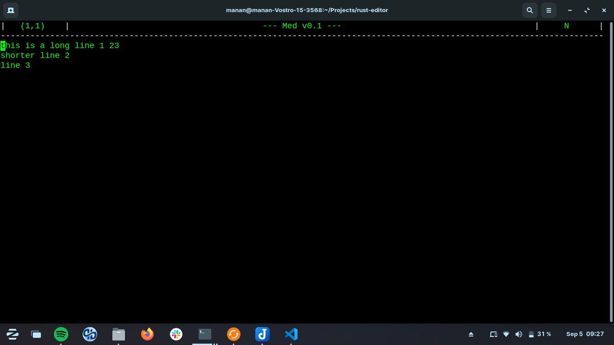

# Med 

Med is a simple terminal-based text editor written with the goal of understanding how a text editor works under the hood.

## Objectives
- Understand and implement the data structures and algorithms required for a text editor
- Implement the editor (from scratch) to be as efficient as possible 
- Ponder about high level decisions like ease of use, efficiency and necessary features
- Learn a new programming language - rust

## Goals and current progress
- [x] Basic structure
- [x] File handling
- [x] Move commands
- [x] Text insertion
- [x] Text deletion
- [ ] Line wrap + scroll (?) (!!)
- [ ] Copy / Paste
- [ ] Find / Replace (?)
- [ ] Undo / Redo
- [ ] Highlighting (?)
- [x] Error handling (!!)
- [ ] Switch to better data structures (!!)
    - [x] Split buffer for inter line
    - [ ] Piece table for intra line
- [ ] Commands (!)
- [ ] Create configs
- [x] Implement save (!)

## Look
