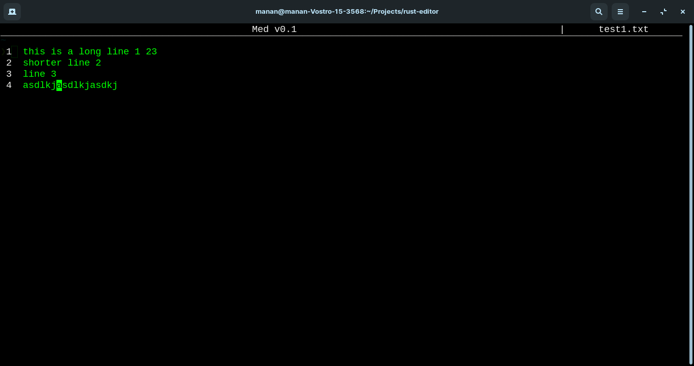

# Med 
A minimal, cross-platform, terminal-baed text editor written in Rust

## Screen

## Usage

### Commands
| Command      | Description    |
| ------------ | -------------- |
| \<Ctrl\> + Q | Quit           |
| \<Ctrl\> + S | Save           |
| F5           | Refresh editor |

## Objectives
- Understand and implement the data structures and algorithms required for a text editor
- Implement the editor (from scratch) to be as efficient as possible with as few dependancies as possible 
- Ponder about high level decisions like ease of use v/s efficiency and necessary features
- Learn a new programming language - Rust

## Progress
- [x] Basic structure
- [x] File handling
- [x] Move commands
- [x] Text insertion
- [x] Text deletion
- [ ] Line wrap + scroll (?) (!!)
- [ ] Copy / Paste
- [ ] Find / Replace (?)
- [ ] Undo / Redo
- [ ] Highlighting (?)
- [x] Error handling (!!)
- [ ] Switch to better data structures (!!)
    - [x] Split buffer for inter line
    - [ ] Piece table for intra line
- [ ] Commands (!)
    - [ ] Prompt for command explanation
- [ ] Create configs
- [x] Implement save (!)
    - [ ] Prommpt if unsaved work